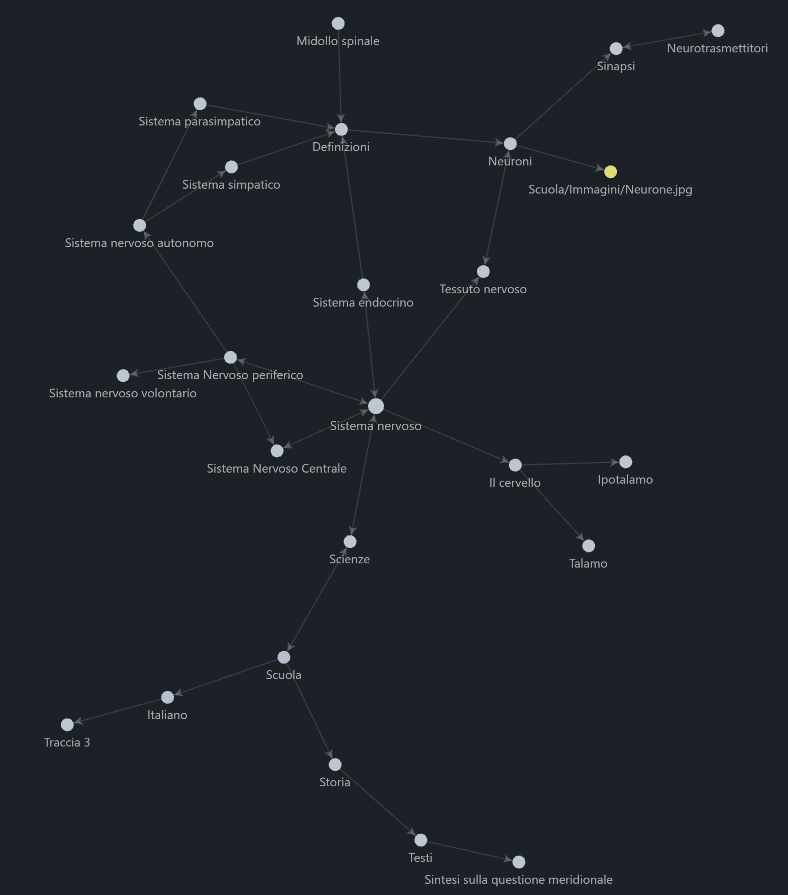

# LEGGIMI

Se vuoi vedere bene le cose [nella cartella Obsidian](Obsidian/Scuola) scarica [Obsidian.md](https://obsidian.md/), è un modo veramente fantastico per creare mappe


## Note a me stesso
```JS
<a href="Storia/storia.html" target="_self" class="link">
  Storia
</a>
```